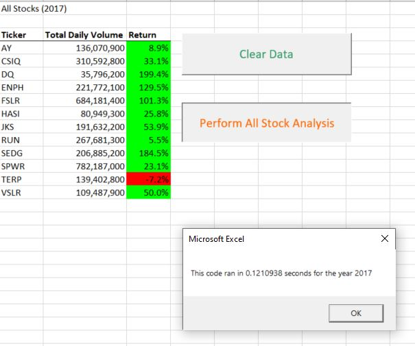

# GreenStocks_Analysis
## Overview of Project
The purpose of this challenge is to the refactor the solution code to loop through all the data one time in order to collect the same information that has been done in this module in a more efficient way. The code that I worked during the module shows a very long run time compared to the refactored code and the results are presented below. 
## Results 
### All Stock Analysis for Year 2017

